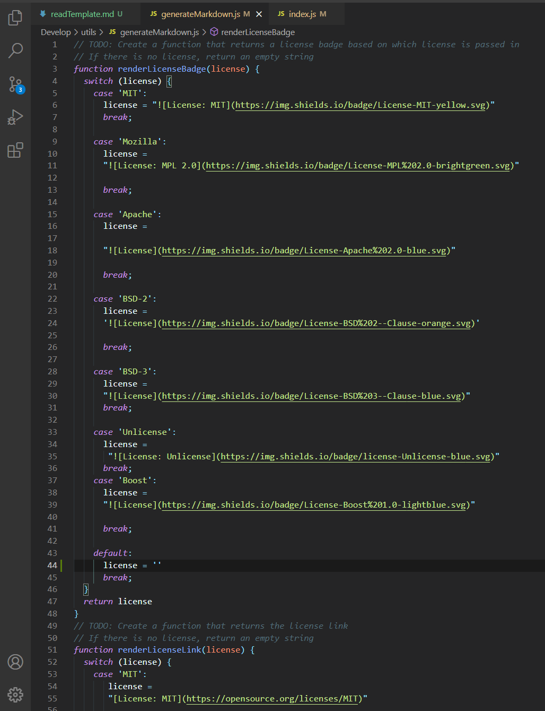
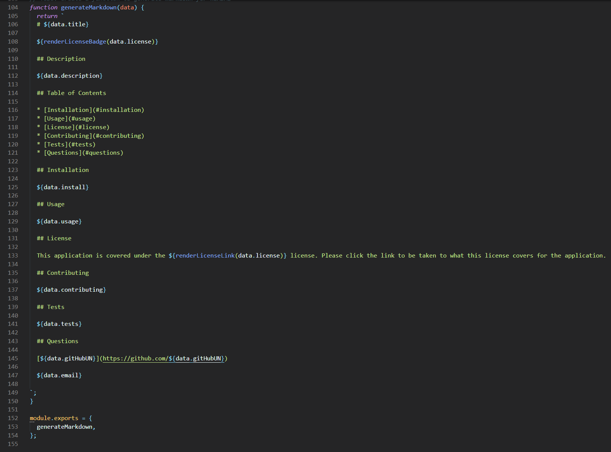
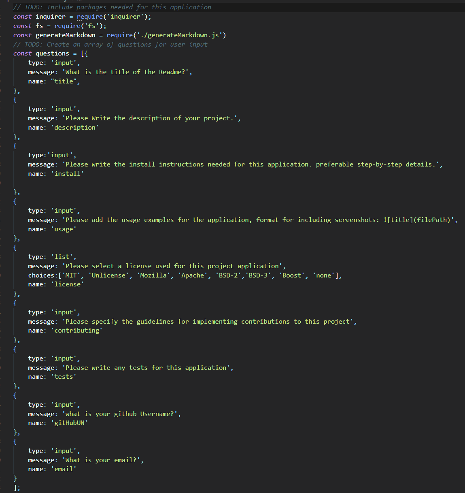
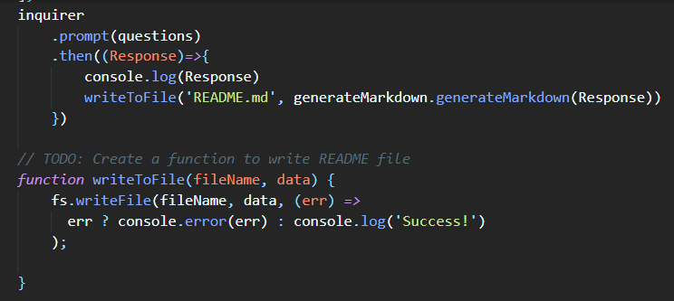

  # README-Generator

  ## Description 
  
  This Application is run using node.js within GitBash. This application runs inquirer prompt questions within the terminal asking the user a series of questions on what the Readme will include. Questions include the title of the document, the license, install instructions, and personal contact details to reach the user for any questions. The application then uses the fs.writeToFile method to create or write over the readme file without the user having to do it manually. 

  Here is a walkthrough Video running this application and showing the readme Generated file: [Walkthrough](https://youtu.be/EOkHzdRW_j4)

  ## Table of Contents
  
  * [Installation](#installation)
  * [Usage](#usage)
  * [License](#license)
  * [Contributing](#contributing)
  * [Tests](#tests)
  * [Questions](#questions)
  
  ## Installation 
  
  Download the code files from the repository found on github. Have Node.js installed before hand. Once completed, head into the directory through git bash and run node init -y to initialize node and generate the json file, once done, run node index.js within the utils folder to start the readme generator.

  ## Usage

  ### generateMarkdown.js

  The usage of this application will generate a professional readme file in a quick amount of time, this could also be refactored to write to other files such as generating index.html files. this file utilizes two files through file modularizations. generateMarkdown.js is the file that creates the switch cases to check what the license choice of the users and will return the badge at the top of the readme and a link to the license within the license section. 
  
  
  

  At the bottom of the generateMarkdown.js file is the function generateMarkdown which will take in all data and place it within the proper format for the readme file. This function returns a template literal with the proper syntax for a readme file with variables placed within their corresponding spot. 

  

  ### Index.js

  This file is what initializes the generator and calls the files needed to run the application. At the top of the file, it calls on the npm package [inquirer](https://www.npmjs.com/package/inquirer) which can be found here, the fs to call on methods such as writing to other files within the directory, and then the generateMarkdonwn.js file which has the license and markdown functions. Once those are called, a questions array stores objects of questions with certain inputs to be able to iterate through during the terminal call. 

  

  ### Inquirer 

  The bottom half of the index.js in the inquirer call that allows for the prompt. This creates the inquirer prompt which iterates through questions array one by one and then logs all the inputs to the console. Once the response is logged, then the writeToFile function is called to write to a specified file with the certain data parameters.

  

  ## License 
  
  This application is covered under the  license. Please click the link to be taken to what this license covers for the application.

  ## Contributing

  No guidelines for implementing contributions to this project.
  
  ## Tests

  No tests run witin this application.
  
  ## Questions
  
  If there are any questions or want to leave feedback about the project, follow the links below to conatct me. 

  [PN-Barnes](https://github.com/PN-Barnes)
  
  paulieb99@gmail.com
  
